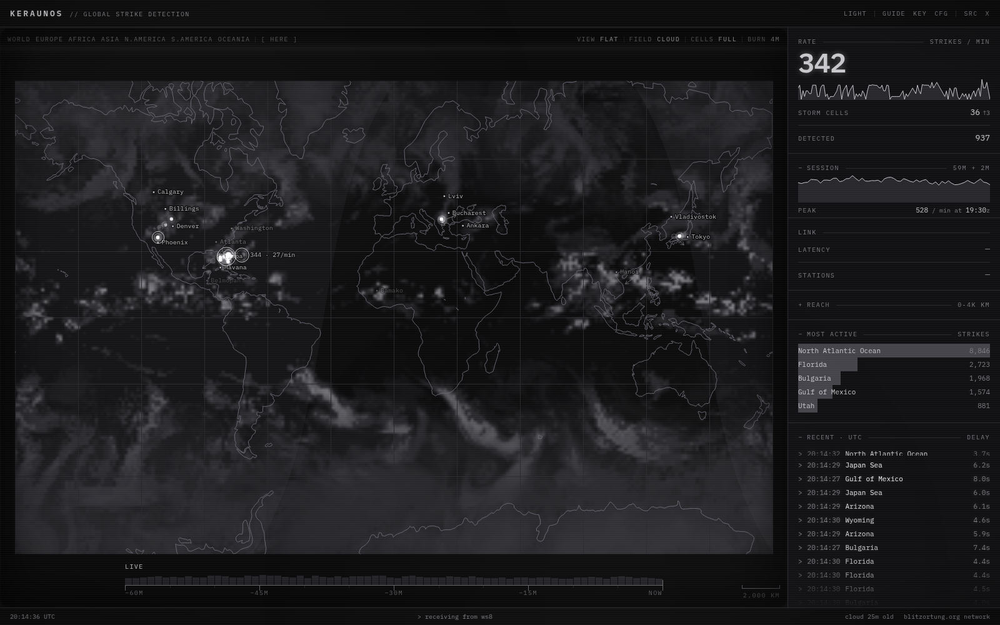
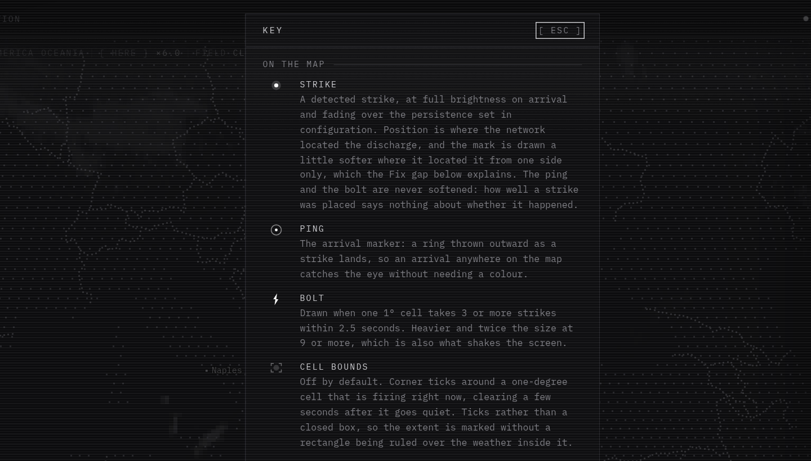
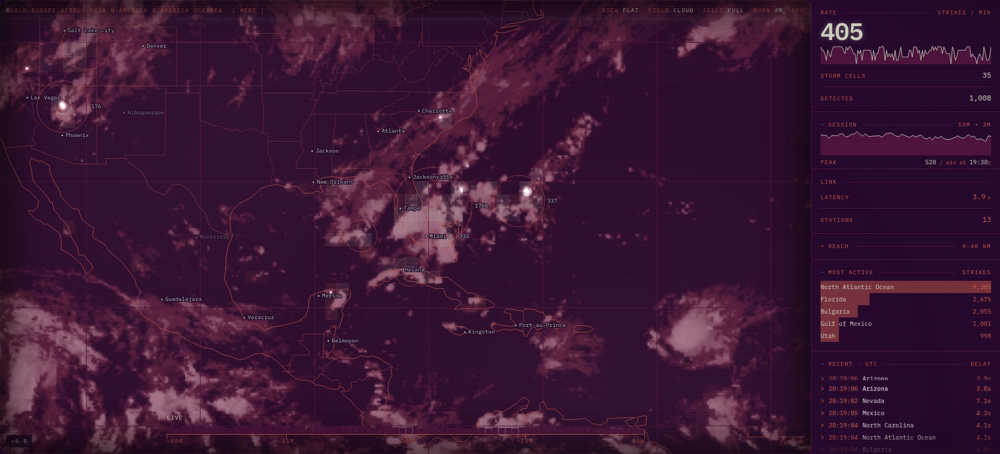
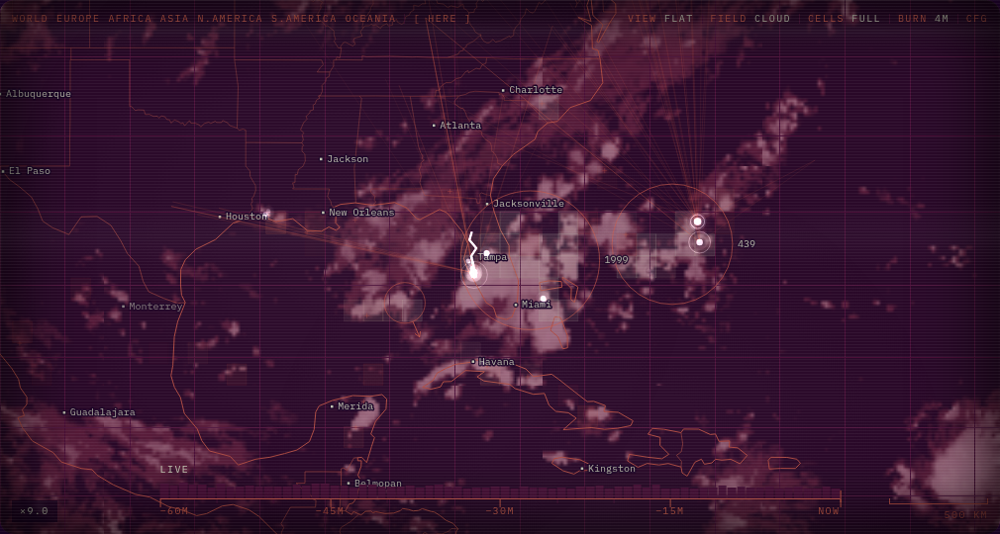

# Keraunos

κεραυνός: the thunderbolt.

**Every lightning strike on earth, as it is detected.**
[**Open the instrument →**](https://keraunos.corvardt.com)



Live strikes from the [Blitzortung](https://www.blitzortung.org/) network, plotted
on a world map as they arrive. Strikes land at full white and fade, busy cells
burn into the map, and clusters are tracked as storm cells with a heading, a
ground speed, and a second ring when their flash rate is climbing.

No account and no key. A small relay holds one connection to Blitzortung and
passes the frames on unchanged. It stores nothing and remembers nothing, and
everything the page works out from them goes when the tab does.

## Using it

Open it and watch. If you want to drive it, this is the whole of it:

| | |
| --- | --- |
| **Point** | The map reads out the place under the pointer, its coordinates, and the strike count for that 1° cell |
| **Pick** | Click the map, a feed row, or a ranked place to narrow everything to it; click a storm cell to narrow to the cell rather than the country. Click again or press `esc` to clear |
| **Move** | Drag to pan, wheel or pinch to zoom in to about 200 km across. The region names along the top of the map jump straight there |
| **Rewind** | The track along the bottom opens on the relay's last half hour and grows to the hour. Its bars are how busy each slice of the window was. Drag anywhere on it to set the clock down at that moment; it then runs forward until it catches up and hands back to live, at life size or at ×8 or ×30 |
| **Here** | Asks the browser for your location (only when pressed), frames the map on it, and reads out how far away the nearest strike is and how long until its thunder. Session only: not stored, not sent anywhere |
| **Link** | Zoomed in, the address carries the view as `#lon/lat/zoom`, so a view can be handed to someone |
| **Save** | Configuration holds two exports: the retained strikes as CSV, and the frame as drawn, rewound or live, as a PNG |
| **Hold** | The feed stops advancing while the pointer rests on it, and queues arrivals behind |
| **Guide** | Seven steps that light each control on the running map in turn. Opens itself once on a first visit; `g` or `guide` afterwards, `esc` to skip |

**Keys.** `k` key panel · `c` configuration · `g` guide · `t` dark/light ·
`esc` close a panel, or clear the current selection. With the map focused, `+`
and `-` zoom (or spin the globe) and `0` returns to the whole world. The rewind
track takes arrow keys, `home` and `end`.

The guide is the way in; the key panel (`k`) is the reference. The guide runs
on the live map, dimming everything except the control it is talking about and
leaving that control working, so pressing `here` while it explains `here` is
the short version of the explanation. It covers the seven things you need
before you can read the map at all, and then stops. The key panel is the full
catalogue: every mark on the map and every figure beside it.



## Four dials on the map

Beside the region presets, showing the setting they are on. These are the ones
worth changing while you watch, which is why they are not behind a panel.

| Dial | Stops | |
| --- | --- | --- |
| **view** | flat · globe | Flat is the whole planet at once, which is what this is mostly for. Globe is the same data on a sphere: half a world at a time, turned by dragging |
| **field** | off · cloud · rain | What sits behind the map; see below |
| **cells** | off · ring · track · full | How much a storm cell carries. Ring is the cell and its flash count, track adds where it has been, full adds where it is going and how fast |
| **burn** | 4m · 20m · 1h | How far back the burn-in reaches. Four minutes is where it is raining lightning *now*; an hour is where it has been this session |

## What the panel is telling you

| Reading | |
| --- | --- |
| **Rate** | Strikes a minute over the last 60 seconds, with a trace, and the number of storm cells being tracked. An `↑` counts the cells whose flash rate is climbing sharply |
| **Session** | Arrivals by the minute for as long as the tab has been open, the hairline at midnight UTC, and the hardest minute of it. Lightning runs on a schedule: the planet fires hardest over land in the afternoon, so the global rate rises and falls about three times a day as Africa, the Americas and Asia come round into the sun. An hour of history cannot show that; a day of it can |
| **Link** | Median delay from a strike happening to this browser hearing about it, and the median number of detectors used to place recent strikes |
| **Reach** | How far each strike was heard, split into daylight paths and darkness. The far end should be longer at night: sunlight makes a lossy layer at 60 to 70 km that the signal has to bounce off, and after sunset the reflection moves up to 85 to 90 km, where less is lost at every hop |
| **Here** | Present once you have pressed `here`: distance to the nearest strike, and a countdown to its thunder |
| **Most active** | Places holding the cells still burning right now, not session totals. Click one to narrow the map to it |
| **Strike feed** | Each arrival as it lands, named. Click a row to narrow to that place |

## Configuration

`c` opens it. Everything is stored in this browser and nowhere else.

| Group | What it holds |
| --- | --- |
| **Tube** | Phosphor (white, green, amber, ice, and the borrowed palettes oil, crimson, demon; dark mode only), contrast, and bloom |
| **Layout** | Whether the side panel, header and footer are shown at all |
| **Screen** | Scanlines, refresh sweep, strike shake, detector clicks, thunder |
| **Map** | Cell bounds, graticule, frontiers, daylight, capitals, detector threads, imager coverage, aurora, how long a strike stays lit |
| **Panel** | Which of the readings above are drawn |
| **Session** | The two exports: strikes as CSV, the frame as PNG |

Both sounds are off until asked for, and thunder needs a position before it can
do anything: it is the delay between a strike and its sound reaching where you
said you are.



## Things worth knowing

### Who heard it

Blitzortung is volunteer hardware. Every strike here is a time-of-arrival fix
from stations somebody built, powers and hosts, and the instrument will show you
which ones heard each discharge: turn on **detector threads** and each strike
throws a line back to every station that helped place it, for under a second.



The shape of that sheaf is how well the strike was placed. A strike caught in a
full sheaf was pinned from every side; one wearing a fan was heard from a single
direction, and is drawn a little softer for it. Most of what this network sees,
it sees from one side: on a typical strike the widest gap in the ring of
stations around it runs past 200°.

Nobody publishes where the detectors are. The ones on the map are assembled from
the strikes themselves, over about half a minute of listening, which is also why
the map has more on it a minute in than it does on arrival.

### The two fields

Infrared reads the top of the storm column from orbit; radar reads what is
falling out of the bottom of it from the ground. They are alternatives rather
than layers, because where they overlap they are drawing the same storm.

Their footprints are nearly complementary, and that is the interesting half of
the choice. Cloud covers the whole planet including every ocean. Rain covers the
ground somebody built and maintains a radar network on, and stops, often
sharply, at a coastline. So empty means something different on each: on the
cloud field it means clear, and on the rain field it means unwatched, which over
most of the planet is what it is.

### Imager coverage

Off by default. It is what MTG's Lightning Imager saw of the same five minutes
from orbit, over the third of the planet that dish can see.

It is worth turning on because the two instruments disagree, and the
disagreement is the reading. This network listens for radio from the ground, so
what it hears depends on where somebody built a detector, and it hears the
cloud-to-ground stroke far better than the discharge that stays inside the
cloud. The imager photographs the optical flash instead, and does it as well
over the middle of the Atlantic as over Berlin. Where both are lit, two
unrelated instruments agree there is a storm there. Where the layer is lit and
no strikes arrive, the network is deaf rather than the sky quiet, which over
central Africa is most of the time.

It runs about fifteen minutes behind the strikes on top of it, because a
five-minute accumulation has to close before it can be processed and published.
An unlit patch under a firing cell usually means the satellite has not been
asked yet.

### The other electricity

Off by default. The auroral oval is where the solar wind is being funnelled down
the earth's own field lines into the top of the atmosphere, and it is the one
layer here that can be on beside everything else without arguing with it: it
lives at the latitudes lightning does not, so it cannot cover a reading. Worth
turning the globe for, because a sphere shows a whole polar cap at once where a
flat map cuts the same ring into two unrecognisable arcs along its edges.

It is also the one thing on this instrument that has not happened yet.
Everything else here was measured; this is NOAA's OVATION model, driven by the
solar wind as it is read at L1 about an hour upstream of us, which is exactly
what buys it the lead time. The panel says how far ahead it is looking.

The curtain shimmers, on a slow wave that runs around the oval rather than
pulsing all at once, which is roughly what a substorm does. The shimmer is
texture and says nothing: it moves a third of the weight, and where the oval
sits and how bright it is are the model's to report. It holds still for anyone
who has asked their system for reduced motion.

### How far back you can go

An hour, if an hour fits. The rewind track is as long as the history actually
held: up to 120,000 strikes are retained, so at the quiet end of the world's
rate the full hour is comfortable, and at the peak the ceiling binds first and
the window is shorter. A session opens on the half hour the relay was holding
and the track grows to the hour from there, showing what it has rather than
what it wishes it had.

Setting the clock down starts it running forward again, rather than freezing a
frame: what you want from a map of a storm is to watch the storm move. Life size
is the reading, and half an hour of it takes half an hour, so the speed switch
beside the track offers ×8 and ×30; the whole window under a minute is about the
pace a cell's own movement reads at.

Storm rings are replayed too, which they were not before. A track cannot be read
off an instant, so the tracker is walked across the window to the moment being
shown, at the twenty-second cadence it samples a centroid on: a running replay
advances it a step at a time, and a scrub pays one forty-millisecond walk when
it settles. Bolts and the chassis knock are still not replayed, because an event
does not happen twice, and nothing is lost behind you, so returning to live
finds the present already there.

### Place names

Capitals are lit by the weather rather than drawn as furniture. A name surfaces
when a burning cell is within 400 km of it and fades with the smudge underneath,
so a quiet map carries no names at all. Pointing at the map already names
whatever is under the cursor, in the corner, on demand.

### Leaving with something

Everything here comes from a stream nobody archives and is held for an hour in a
tab. Closing it loses the hour, which is right for a live map and wrong for the
one afternoon the storm was worth keeping.

The **CSV** is exactly what is retained: `flash_utc`, `received_utc`, `lon`,
`lat`, one row per strike, nothing reconstructed. The gap between the two times
is the network's own delay, strike by strike. It is the figure the panel only
ever shows you the median of.

The **PNG** is the frame as drawn, read off the canvas: scrub to the squall and
save, and what you get is the squall. It is the one way a moment can be handed
to somebody. A link cannot do it: the address carries the view, but the strikes
under it belong to this session and cannot travel, so a shared URL opens on the
right coordinates with whatever weather happens to be there.

## One socket, not one per reader

Blitzortung asks that a project using their data take it from its own server
rather than from theirs, and it is easy to see why: every open tab used to hold
its own connection, so a hundred people watching was a hundred connections to
hardware that volunteers buy, power and host.

`relay/` is that server. It is a single Cloudflare Durable Object holding one
upstream connection however many people are watching, fanning the frames out
untouched.

It also keeps the last half hour, in memory and nowhere else: three numbers a
strike, where and when, about 160 KB of it, handed to a visitor as one binary
frame before the live feed starts. Without it a new tab is an empty map that
takes twelve minutes to find a storm cell and ten more to say where it is
going, which is most of what this instrument does and all of it withheld from
anybody who did not stay. Nothing about a reader is stored, or could be: the
relay knows nothing about anybody watching, the half hour is the same public
lightning for everyone, and it is gone the moment the object is evicted. The
instrument is still built entirely in your own tab, from a feed that now
arrives by way of one socket instead of thousands.

## Running it yourself

```sh
npm install
npm run dev      # dev server
npm run build    # production build
npm run lint
npm run check    # checks the palette, the geometry and the fetched fields against live data
```

The page needs a relay to get its strikes from. Deploy one to your own
Cloudflare account, or run it locally:

```sh
cd relay && npm install
npm run dev      # serves ws://localhost:8787/feed
npm run deploy   # to your account, once wrangler is logged in
```

Then point the site at it: copy `.env.example` to `.env.local` and set
`VITE_FEED_URL`. Set `ALLOWED_ORIGINS` in `relay/wrangler.jsonc` before the
relay is reachable from the internet, or anyone who finds the hostname can use
it and the single-socket property becomes theirs to spend.

No API keys anywhere.

`node scripts/KeraunosSeeker.cjs` is a standalone Node client that prints the same
stream to the terminal. It connects to Blitzortung directly, so it is a tool for
one person at a terminal rather than something to put behind a website.

The pictures in this file are captured from the running instrument rather than
pasted in once, so they can be taken again when it changes:

```sh
npm run dev                    # in another terminal
npm run shots                  # all of them, into docs/shots and public/og.png
npm run shots -- hero          # one
VIEW=-99.4/41.2/6 npm run shots -- hero   # framed somewhere else
```

Each shot soaks before it fires: grabbed on load, the instrument is a black
rectangle and a fair picture of nothing. Pick a `VIEW` that is firing at the
time of the run (the panel's activity ranking says which), or the hero shows an
empty ocean at three in the morning.

## Not a warning system

This is an instrument for watching the weather, not for deciding what to do
about it. Blitzortung is a volunteer network and says so plainly: the data is
for private and entertainment purposes, and explicitly not for storm warning,
for checking overvoltage claims, or for risk analysis. It is not for the
protection of life or property, and neither is this.

That matters here more than it would on a map of dots, because the instrument
will tell you the distance to the nearest strike and count down to its thunder.
Those are the two readings most easily mistaken for a safety tool. They are
arithmetic on a feed that is incomplete by construction: the network hears the
cloud-to-ground stroke far better than the discharge that stays inside a cloud,
and it hears nothing at all where nobody has built a detector. A quiet map is
not a safe sky.

If you need lightning data to make a decision with, use your national
meteorological service.

## Sources

Strikes from the [Blitzortung](https://www.blitzortung.org/) network and its
volunteers, whose data stays under their terms and under CC BY-SA 4.0. The MIT
licence on this repository covers the code in it and nothing else: the strikes
are not this project's to relicense, and commercial use of them is prohibited by
the people who collect them.

Cloud field from [RealEarth](https://realearth.ssec.wisc.edu/) (SSEC, University
of Wisconsin-Madison) and [EUMETSAT](https://www.eumetsat.int/); rain field from
[RainViewer](https://www.rainviewer.com/); imager coverage from EUMETSAT's
MTG-I Lightning Imager; the auroral oval from
[NOAA SWPC](https://www.swpc.noaa.gov/)'s OVATION model. The borrowed phosphor
palettes are credited in `src/lib/palette.js`.
